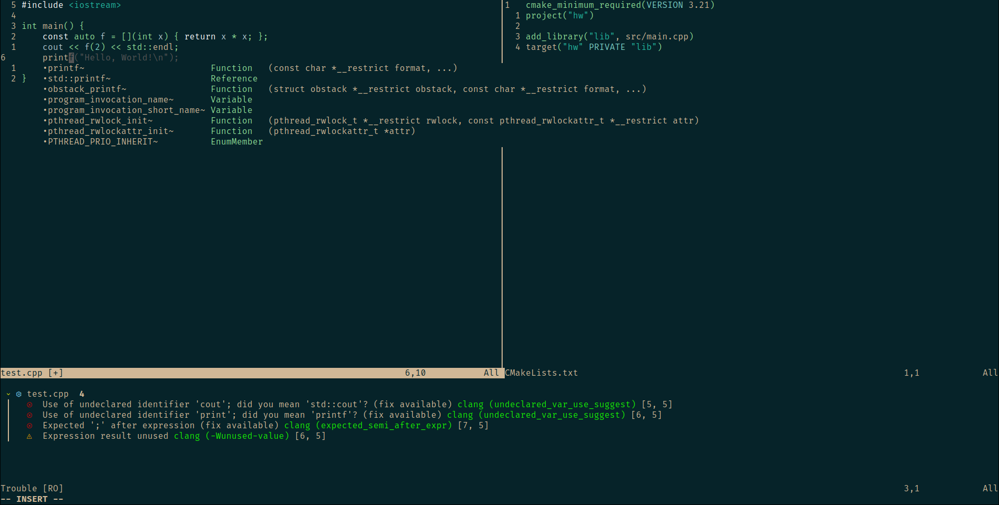

# naysayer.vim
naysayer.vim is a Vim/Neovim colorscheme that is based on Jonathan Blow's Emacs [naysayer theme](https://youtu.be/HkVSTjWZXIU?t=3902), with some small modifications to make it more readable.

## Support
At the moment, naysayer.vim configured to work with:
- [telescope.nvim](https://github.com/nvim-telescope/telescope.nvim)
- [trouble.nvim](https://github.com/folke/trouble.nvim)
- [Copilot.vim](https://github.com/github/copilot.vim)

### Docstring as comments
Using [treesitter](https://github.com/nvim-treesitter/nvim-treesitter), the multiline strings used for documentation are highlighted as comments rather than strings.

## Installation
Using [vim-plug](https://github.com/junegunn/vim-plug)

```viml
Plug 'p0209p/naysayer.vim'
```

Using [dein](https://github.com/Shougo/dein.vim)

```viml
call dein#add('p0209p/naysayer.vim')
```

Using [packer.nvim](https://github.com/wbthomason/packer.nvim)

```lua
use {
  'p0209p/naysayer.vim'
}
```

Using [lazy.nvim](https://github.com/folke/lazy.nvim)

```lua
-- init.lua:
    {
        'p0209p/naysayer.vim'
        priority = 1000,
        lazy = false
    }

-- plugins/telescope.lua:
return {
        'p0209p/naysayer.vim'
        priority = 1000,
        lazy = false
    }
```
## Showcase


